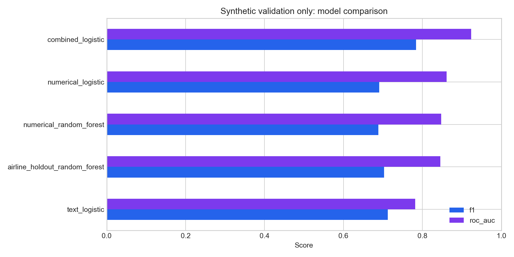
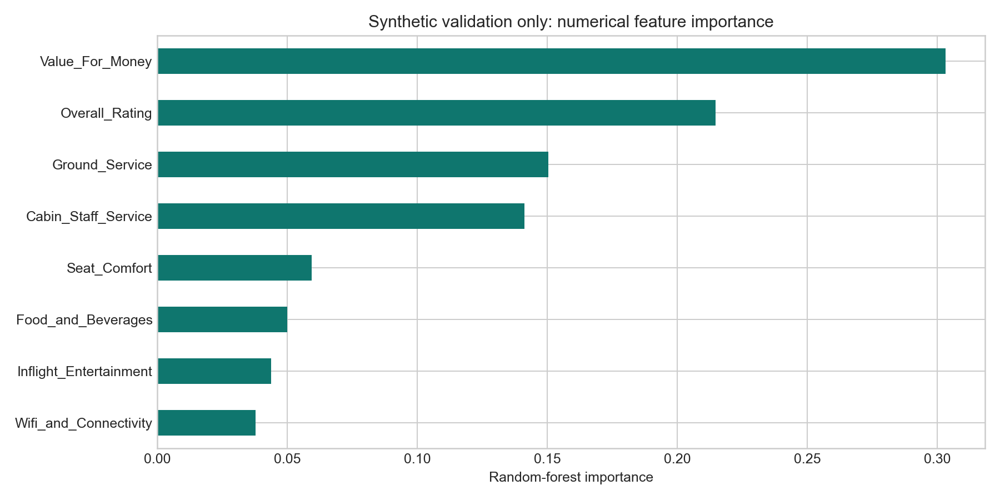

# Airline Review Recommendation Analytics

This project analyses which parts of an airline experience are most closely associated with a customer recommendation. It compares structured service ratings with review text and tests whether the models generalise to airlines excluded from training.

The analysis covers **23,171 reviews across 497 airlines** and compares structured service ratings, TF-IDF text and combined models. Airline-level imputation is fitted **only on the training data**, with a training-derived global fallback for unseen airlines.

## Business question

Airlines collect both structured service scores and open-text reviews, but the two sources do not automatically lead to a decision. This project asks three linked questions:

1. Which service dimensions are most strongly associated with a recommendation?
2. Does review text add useful signal beyond the structured ratings?
3. Does the model still work for an airline it did not observe during training?

The third question is especially important. A random review split can place the same airline in both training and test data, making performance look stronger than it would be for a new carrier. The airline-holdout track therefore tests transfer to genuinely unseen airline groups.

## What I built

I prepared the review data, compared interpretable and non-linear classifiers, created a TF-IDF text track, evaluated a combined feature set and translated the model outputs into service priorities. The workflow keeps every imputation step inside model training, handles unseen airlines explicitly and tests the pipeline for leakage and output integrity.

## Analysis covered

- customer recommendation classification;
- group-aware and random holdout evaluation;
- training-only, airline-level median imputation;
- TF-IDF text modelling alongside service ratings;
- comparable accuracy, precision, recall, F1 and ROC-AUC reporting;
- feature and coefficient evidence translated into commercial action;
- separate reporting for the original academic findings and the synthetic software check.



> **Data note:** the chart above checks the pipeline on synthetic data; it is not a claim about real airline performance. The original university workbook is not redistributed and was not available when this repository was prepared. The code can be rerun when an authorised copy of the source file is restored.

## Validation design

The workflow prevents test-set information from influencing training-time imputation. It follows this sequence:

```text
split reviews
    |
    v
fit airline medians on training rows only
    |
    +--> known airline: training airline median
    +--> unseen airline: training global median
    |
    v
fit model on transformed training set
    |
    v
evaluate untouched test set
```

The included test deliberately creates an unseen airline and confirms that its missing ratings use the training global fallback.

## Modelling tracks

| Track | Inputs | Purpose |
|---|---|---|
| Numerical logistic regression | Eight service ratings | Transparent driver direction |
| Numerical random forest | Eight service ratings | Non-linear benchmark and importance |
| Text logistic regression | TF-IDF review text | Language and complaint signal |
| Combined logistic regression | Ratings + TF-IDF | Test whether text adds predictive lift |
| Airline holdout | Unseen airlines | Generalisation beyond known carriers |



## Business interpretation

The original analysis consistently identified perceived value, ground service and cabin service as commercially important. The corrected evaluation makes those findings easier to test. The output can be used to:

- prioritise service attributes associated with recommendation;
- compare the incremental value of free text against structured ratings;
- audit errors rather than treating one accuracy number as proof;
- distinguish diagnosis after a review from a pre-travel loyalty prediction.

The intended use is service diagnosis: identify where experience scores and customer language point to recurring weaknesses, then test operational improvements against subsequent feedback. It is not a claim that the model can determine why an individual customer behaved as they did.

## Repository guide

| Path | Purpose |
|---|---|
| `src/airline_analytics.py` | Cleaning, training-only imputation, modelling and metrics |
| `scripts/generate_demo_data.py` | Reproducible synthetic validation data |
| `scripts/run_analysis.py` | Command-line workflow for CSV or Excel input |
| `tests/` | Leakage and output checks |
| `data/demo_airline_reviews.csv` | Synthetic data only |
| `outputs/` | Clearly labelled demo metrics and evidence |

## Limitations

- Recommendation is observed after the experience; this is diagnosis, not a pre-flight causal prediction.
- Review platforms are self-selected and may not represent all passengers.
- Structured ratings and recommendation can reflect the same underlying judgement.
- Synthetic validation proves the software path, not the historic performance claims.

## Author

**Muhammad Ahmed Shoaib**<br>
Customer analytics, machine learning and commercial decision support.
